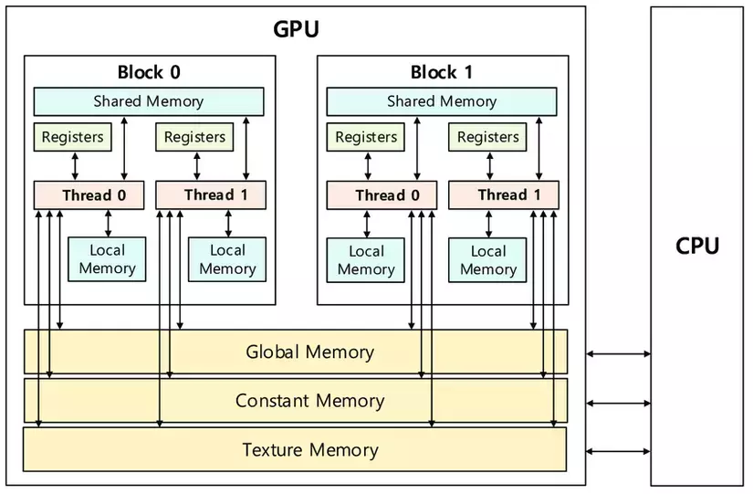
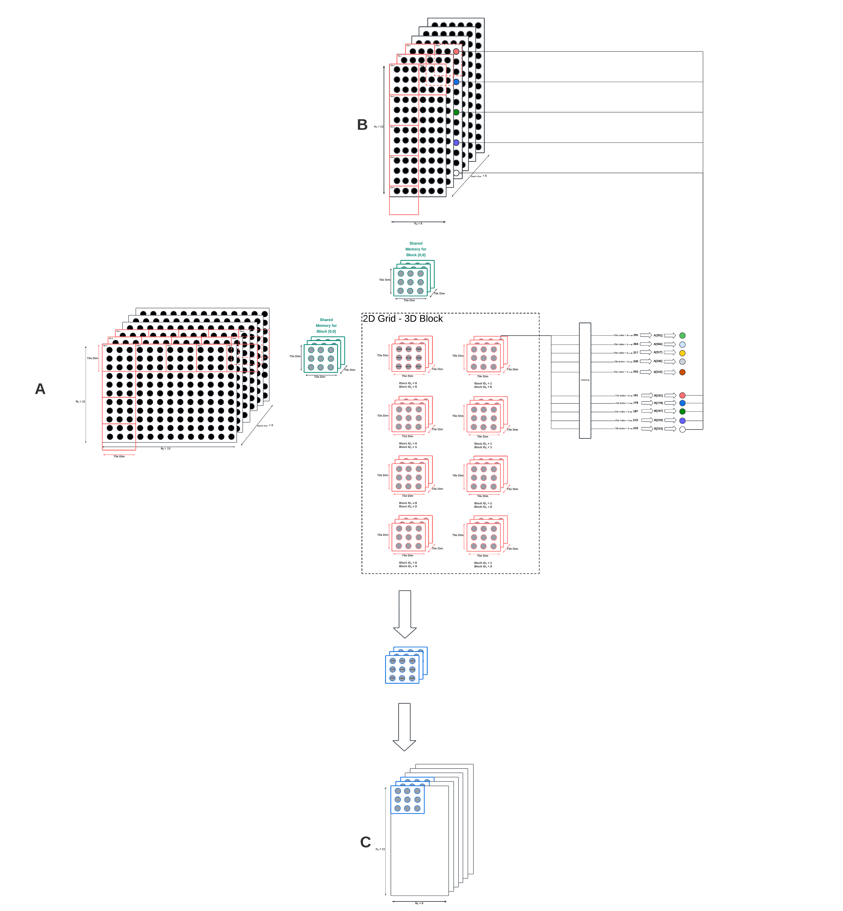
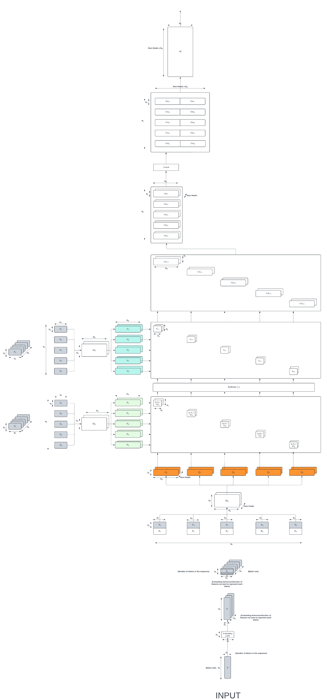

In this project, attention mechanism is implemented in CUDA by utilizing shared memory, coalesced memory, warp shuffle, and tiling. 

    

### Matrix Multiplication 

### Softmax 

### Transpose 

### Multi-Head Attention Mechanism

